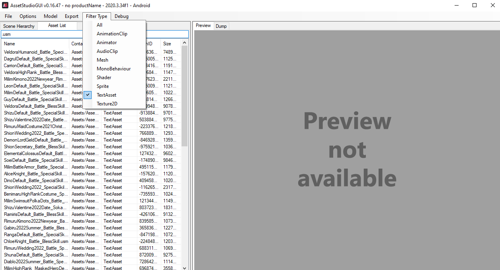

# SLIME: IM Special Moves!

This tool allow you to convert **USM files** to **MP4 files**.

# Installation

You need to add [ffmpeg](https://www.gyan.dev/ffmpeg/builds/) and [crid_mod](https://cdn.discordapp.com/attachments/448202199852646431/708452992331939880/CRID.usmDemux_Tool_v1.02-mod.7z) to Windows path.
**Python 3.6.0 or higher is required**

# Usage

Load the folder with the assets in [AssetStudio](https://github.com/Perfare/AssetStudio). Filter the files so you only see the TextAssets and search **.usm**. All the files listed are the characters special moves so export all or just the ones you need.

Now run the `slime_usm.py` and paste your folder path with the .usm files. When the script finished, you can see the videos in the folder path 